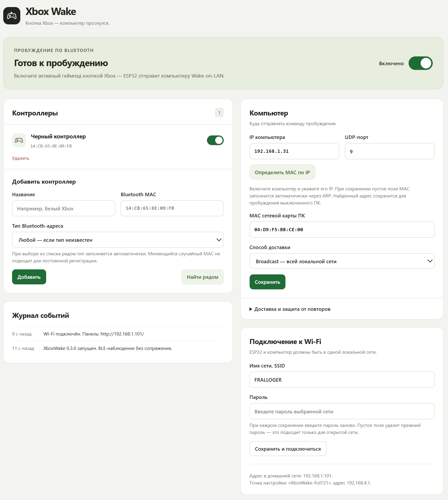

# Xbox Wake

Пробуждение ПК по кнопке Xbox на геймпаде - как на Steam Machine, только для обычного ПК.


## Что это

ESP32-S3 слушает эфир по Bluetooth LE и замечает, когда твой геймпад Xbox включается (жмёшь круглую кнопку Xbox). В этот момент плата отправляет компьютеру пакет Wake-on-LAN по Wi-Fi - и ПК просыпается.



## Возможности

- До 16 сохранённых геймпадов
- Автоопределение MAC сетевой карты ПК по IP через ARP

## Что нужно

- ESP32-S3 (протестировано на такой модели)
- Wake-on-LAN должен быть включён на самом ПК
- ПК желательно подключить к роутеру по кабелю Ethernet

## Прошивка

### Вариант 1 - через браузер

Официальный веб-флешер Espressif работает прямо в Chrome или Edge через Web Serial, без установки Python или чего-либо ещё:

1. Открой [espressif.github.io/esptool-js](https://espressif.github.io/esptool-js/) в Chrome или Edge.
2. Подключи плату по USB, нажми **Connect** и выбери свой COM-порт.
3. Добавь по очереди 4 файла из `bin/esp32s3_ch340/` с адресами:

   | Адрес    | Файл              |
   |----------|-------------------|
   | `0x0`    | `bootloader.bin`  |
   | `0x8000` | `partitions.bin`  |
   | `0xe000` | `boot_app0.bin`   |
   | `0x10000`| `firmware.bin`    |

4. Нажми **Program** и жди завершения записи.

### Вариант 2 - esptool (Python)

Нужен Python с пакетом `esptool`:

```powershell
python -m pip install esptool
```

Дальше подключи плату и запусти:

```powershell
.\flash-ch340.ps1 -Port COM6
```

(укажи свой COM-порт).

## Первая настройка

1. Подключись к Wi-Fi `XboxWake-XXXXXX` (пароль - likeValve) и открой `http://192.168.4.1/`.
2. Впиши SSID и пароль домашней сети (нужна сеть 2,4 ГГц).
3. Пока ПК **включён**, впиши его IP в разделе «Компьютер» и сохрани - MAC найдётся автоматически по ARP.
4. Способ доставки оставь **Broadcast** по умолчанию.
6. Включи главный переключатель и добавь свой геймпад (кнопка «Найти рядом» подсветит его, когда включишь Xbox-кнопкой рядом с платой).

Готово - теперь кнопка Xbox на геймпаде включает компьютер.

## Как это работает технически

```
Нажал Xbox на выключенном геймпаде
        ↓
Геймпад начинает искать Bluetooth-соединение (BLE-объявления)
        ↓
ESP32-S3 замечает объявления зарегистрированного геймпада
        ↓
Отправляет Wake-on-LAN по Wi-Fi (broadcast, UDP)
        ↓
ПК просыпается / включается
        ↓
Геймпад подключается напрямую к ПК
```

