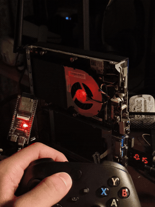

# Xbox Wake

Пробуждение ПК по кнопке Xbox на геймпаде — как на Steam Machine, только для обычного ПК.



## Что это

ESP32-S3 слушает эфир по Bluetooth LE и замечает, когда твой геймпад Xbox включается (жмёшь круглую кнопку Xbox). В этот момент плата отправляет компьютеру пакет Wake-on-LAN по Wi-Fi — и ПК просыпается, из сна или из полного выключения. Геймпад при этом сопрягается с самим компьютером напрямую, как обычно; ESP32 только следит за эфиром и ни во что не встраивается.

Управление — через веб-панель, которую поднимает сама плата: регистрация геймпадов, общий переключатель, настройки ПК и Wi-Fi.

## Возможности

- До 16 сохранённых геймпадов, у каждого свой тумблер включён/выключен
- Общий переключатель — мгновенно блокирует пробуждение от всех геймпадов сразу
- Автоопределение MAC сетевой карты ПК по IP (через ARP), вручную вбивать не обязательно
- Защита от повторных срабатываний: тишина в эфире + пауза между отправками WoL
- Настройка Wi-Fi через встроенную точку доступа, без перепрошивки

## Что нужно

- ESP32-S3 (проверено на плате с CH340; вариант с родным USB тоже подходит, но `Serial` тогда должен идти через USB CDC — см. `platformio.ini`)
- Питание платы, которое не пропадает при выключенном ПК (отдельный USB-блок или разъём на материнке)
- Wake-on-LAN должен быть включён на самом ПК (BIOS + сетевой адаптер) — без этого дальше смысла нет
- ПК желательно подключить к роутеру по кабелю Ethernet; ESP32 достаточно Wi-Fi 2,4 ГГц

## Прошивка

### Вариант 1 — готовый бинарник (быстрее)

В `bin/esp32s3_ch340/` лежит собранная прошивка. Нужен Python с пакетом `esptool`:

```powershell
python -m pip install esptool
```

Дальше подключи плату и запусти:

```powershell
.\flash-ch340.ps1 -Port COM6
```

(укажи свой COM-порт; посмотреть его — в диспетчере устройств).

### Вариант 2 — собрать из исходников

Исходники — в `firmware/XboxWake/`, конфигурация — в `platformio.ini` (окружение `esp32s3_ch340`):

```bash
pio run -e esp32s3_ch340
pio run -e esp32s3_ch340 -t upload --upload-port COM6
```

Если у тебя не CH340-плата, а с родным USB (например, Seeed XIAO ESP32S3) — используй окружение `xiao_esp32s3` и не забудь, что `Serial` там переключается на USB CDC.

## Первая настройка

1. Открой монитор порта на 115200 бод, отправь `INFO` — плата покажет имя и пароль своей точки настройки.
2. Подключись к Wi-Fi `XboxWake-XXXXXX` (пароль из шага 1) и открой `http://192.168.4.1/`.
3. Впиши SSID и пароль домашней сети (нужна сеть 2,4 ГГц).
4. Пока ПК **включён**, впиши его IP в разделе «Компьютер» и сохрани — MAC найдётся автоматически по ARP.
5. Способ доставки оставь **Broadcast** — он не зависит от ARP и надёжно доходит даже до выключенного ПК.
6. Включи главный переключатель и добавь свой геймпад (кнопка «Найти рядом» подсветит его, когда включишь Xbox-кнопкой рядом с платой).

Готово — теперь кнопка Xbox на геймпаде включает компьютер.

## Как это работает технически

```
Нажал Xbox на выключенном геймпаде
        ↓
Геймпад начинает искать Bluetooth-соединение (BLE-объявления)
        ↓
ESP32-S3 замечает объявления зарегистрированного геймпада
        ↓
Отправляет Wake-on-LAN по Wi-Fi (broadcast, UDP)
        ↓
ПК просыпается / включается
        ↓
Геймпад подключается напрямую к ПК — без участия ESP32
```

## Ограничения

- Плата видит **появление геймпада в эфире**, а не само нажатие кнопки — это достаточно для сценария «геймпад выключен → нажал Xbox → ПК проснулся», но включённый геймпад, который просто заново ищет соединение, тоже может разбудить ПК. Перед сном компьютера выключай геймпад.
- Веб-панель рассчитана на доверенную домашнюю сеть, отдельного пароля администратора нет — не выставляй её в интернет.
